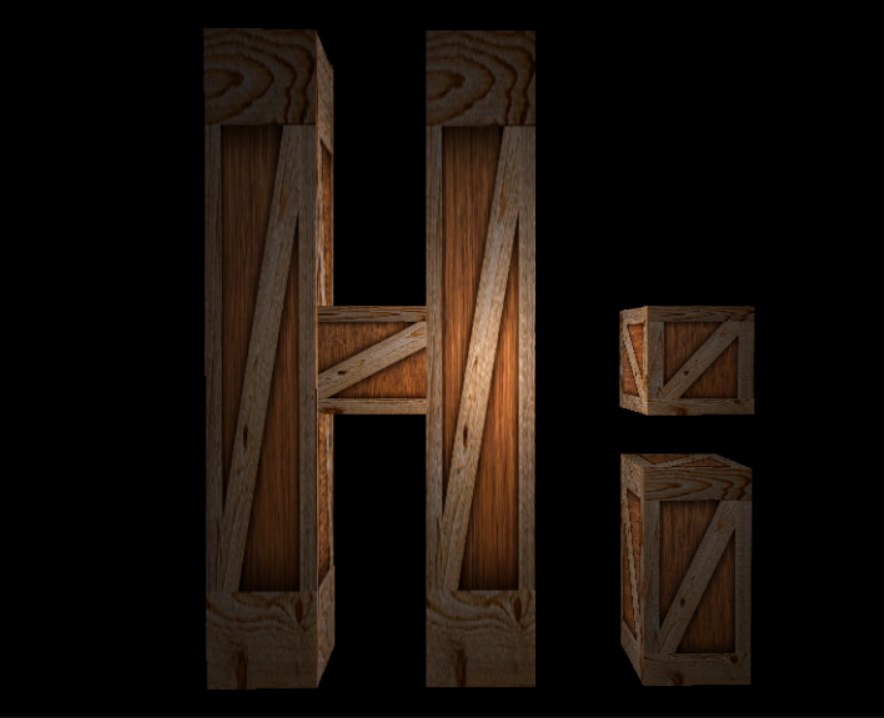

# Magic
3D Engine - OpenGL/GLFW/C++

This project is a playground for developing different graphical systems using OpenGL.

It currently supports loading in mesh data for models in addition to basic textures. It also supports basic lighting shaders. It has functionality also for movable camera with fully implemented 3D projection matrices

